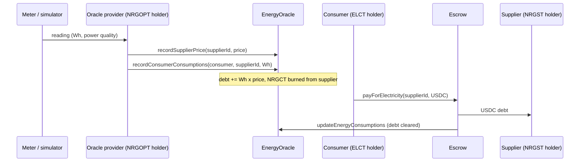

# Arc mainnet deployment

DefiEnergySupply runs on [Arc](https://docs.arc.io), Circle's L1 where USDC is the native gas
token. The contracts are the same Solidity sources as the Base Sepolia deployment, with **no source
changes**. Only the deployment configuration differs.

> **Status:** research prototype. The contracts have **not been audited**. Demo readings are
> **simulated**, not taken from a physical meter.

## Why Arc

- **One asset for energy and fees.** Consumers pay for electricity in USDC through `Escrow`, and
  gas on Arc is also paid in USDC. Microgrid participants do not need a separate gas token.
- **Finality on inclusion.** Per the Arc docs, a transaction is final once it is included, so a
  supplier can treat a settled payment as final after one confirmation.
- **Native USDC.** `Escrow` pays suppliers in Circle-issued USDC on Arc, not in a mock or a bridged
  stand-in.

## Settlement flow



## Arc configuration

| Item | Value | Source |
|---|---|---|
| Chain id | 5042 | [Connect to Arc](https://docs.arc.io/arc/references/connect-to-arc.md) |
| RPC | `https://rpc.mainnet.arc.io` (other providers listed in the docs) | same |
| Explorer | `https://explorer.arc.io` (Blockscout) | same |
| USDC (ERC-20 interface, 6 decimals) | `0x3600000000000000000000000000000000000000` | [Contract addresses](https://docs.arc.io/arc/references/contract-addresses.md) |

Deployment choices:

- **Stablecoins.** `Main` takes USDC, DAI and USDT addresses. Arc has no DAI or USDT, so the USDC
  address fills all three slots. `Escrow` therefore accepts USDC only.
- **Units.** 1 NRGCT base unit = 1 Wh, and the supplier price is in USDC base units (6 decimals) per
  Wh. With this convention `debtsUSD = Wh x price` is a USDC amount and no contract change is
  needed. Note: the project docs describe NRGCT as "1 per kWh"; on Arc the convention above is used.
- **Fee.** 10 USDC base units (0.00001 USDC) per payment, the same value as the Base Sepolia script.
- **Credit hand-off.** Consumption burns NRGCT from the supplier, and production mints NRGCT to the
  producer. In the demo, the supplier is also registered as the producer.
- **Power quality.** The contracts store one price per supplier. In the demo, the oracle computes a
  quality-adjusted price off-chain before each reading: lower when supplied voltage THD is above 8%
  (EN 50160), higher when the consumer power factor is below 0.95. The adjustment sizes are
  placeholders.
- **Arc behaviour.** The contracts do not use `msg.value`, `PREVRANDAO`, `SELFDESTRUCT` or blob
  opcodes. USDC moves only through its ERC-20 interface.

## Deployed contracts (Arc mainnet)

All contracts are source-verified (exact match) on Sourcify and on the Arc explorer.

| Contract | Address |
|---|---|
| Main | [`0x60157fe5101bcD5168653841Df6Ee0a7BB49B5F8`](https://explorer.arc.io/address/0x60157fe5101bcD5168653841Df6Ee0a7BB49B5F8) |
| Register | [`0xf36BE8463c25e9AA235185dfbe344Fc486Ba7889`](https://explorer.arc.io/address/0xf36BE8463c25e9AA235185dfbe344Fc486Ba7889) |
| EnergyOracle | [`0x1ee86eA9De1954a04e0DeF1E101CD99D050bDa99`](https://explorer.arc.io/address/0x1ee86eA9De1954a04e0DeF1E101CD99D050bDa99) |
| Escrow | [`0xf94f258B6D0B78724864Db76C58E97c7F0C40d9D`](https://explorer.arc.io/address/0xf94f258B6D0B78724864Db76C58E97c7F0C40d9D) |
| StakingReward | [`0x7364f9bf517FcB23a883bEb11cacEf7D1254bb7c`](https://explorer.arc.io/address/0x7364f9bf517FcB23a883bEb11cacEf7D1254bb7c) |
| EnergyCreditToken (NRGCT) | [`0xaDcDaBD5b96Af2c89829128321d913CF939d8604`](https://explorer.arc.io/address/0xaDcDaBD5b96Af2c89829128321d913CF939d8604) |
| MicrogridGovernanceToken (MGT) | [`0x100FEb2D822CBb32C4e8f047D43615AC8851Ed79`](https://explorer.arc.io/address/0x100FEb2D822CBb32C4e8f047D43615AC8851Ed79) |
| EnergyProducerToken (NRGPT) | [`0x9e3743dEC51b82BD83d7fF7557650BF1C75ee096`](https://explorer.arc.io/address/0x9e3743dEC51b82BD83d7fF7557650BF1C75ee096) |
| EnergySupplierToken (NRGST) | [`0xdBe4bE33Af0a1671CCf4B6834E5F67bDa7250C42`](https://explorer.arc.io/address/0xdBe4bE33Af0a1671CCf4B6834E5F67bDa7250C42) |
| EnergyOracleProviderToken (NRGOPT) | [`0x1F413a58aa40Ed00ABdD2e61Ef87C27Af1200a9d`](https://explorer.arc.io/address/0x1F413a58aa40Ed00ABdD2e61Ef87C27Af1200a9d) |
| ElectricityConsumerToken (ELCT) | [`0x21e633FAE68838d3B517EBE72f4d01b18dC2b815`](https://explorer.arc.io/address/0x21e633FAE68838d3B517EBE72f4d01b18dC2b815) |

Demo run on Arc mainnet (2026-10-06): 25 transactions, all successful. Each payment moves USDC
from the consumer to `Escrow`, then to the supplier and the fee receiver.

| Reading | Consumption recorded | USDC payment |
|---|---|---|
| 1 | [0x5edfa5a7...](https://explorer.arc.io/tx/0x5edfa5a70d12f13bac741ecc29445b2cba1405ca0bf3b94aa25477477bf20e64) | [0xba8a508c...](https://explorer.arc.io/tx/0xba8a508ca3fe93885192b5d7faa8e283d10096a3dc8d26bcb8a9d14220b595e8) |
| 2 | [0x24823ac2...](https://explorer.arc.io/tx/0x24823ac25083186d23d06f1b38c44f7b1708a20aff0fd1908c889b5136cc1fc6) | [0x5c77a420...](https://explorer.arc.io/tx/0x5c77a4205f54e4b7252ae14607dda22238d4abbc74a4ceaa483302330453018e) |
| 3 | [0x09a77d15...](https://explorer.arc.io/tx/0x09a77d15cb600160fcd98659b56f2b1d26b8fe243c6d756deca94752c914b1e5) | [0x039126e2...](https://explorer.arc.io/tx/0x039126e21b09c175c7737ca886e76ddf19d83dcd1393700c1fa210ad8df29e6c) |
| 4 | [0x00644aec...](https://explorer.arc.io/tx/0x00644aec4dbb00d0b3e1532f9a904ea4c254bb289126f6e07498c22dbbfbb106) | [0x7171ffa9...](https://explorer.arc.io/tx/0x7171ffa95933717d4ec00d2fcbc624c1b96b53fce39006678b53cf364023c7aa) |
| 5 | [0x741dbff0...](https://explorer.arc.io/tx/0x741dbff060e5776c212d1e37fcf5315c26f0718f35066798a82cd5138a74833f) | [0xa9761526...](https://explorer.arc.io/tx/0xa9761526975c73f66ff30cde6b86c1566fecc9aea263e1cbe65b7cb7a8a8c7a0) |

Onboarding: [registerOracleProvider](https://explorer.arc.io/tx/0x0ac54f6b03e2cc4b094dbd4828f8c4680c0c77b35b1d094fe3dcad9978c90967),
[registerSupplier](https://explorer.arc.io/tx/0x4d749fd29754256fcedb56fa637eb89ff00c0531063c471f88b24e6f032145f3),
[registerProducer](https://explorer.arc.io/tx/0x64a668f330f4bd906d7c68231a9c1c852fbd3a573efdbd67fe1ca439fe8368e5),
[registerElectricityConsumer](https://explorer.arc.io/tx/0xbc490f398c8cd99750a63e2f640b62824e90b83fdc11f202ee17268943d53ee0),
[recordEnergyProductions](https://explorer.arc.io/tx/0xc68474e14e42b4bd08cfdfdb92e3152ab27d7fca45c7c970b87b283193f27aa7).

## Run it

The Arc tooling uses Foundry next to the existing Hardhat setup. Files are in `foundry/`.

```bash
forge test
```

The tests deploy the whole system through the same `DesDeployer` code as the deploy script, with a
6-decimal USDC mock. They cover the full reading-to-payment flow, wiring, access checks, a
blocklisted supplier, and a fuzz test for USDC conservation. Two tests document known limitations:
a supplier without NRGCT cannot be billed, and the same reading can be recorded twice.

Arc recommends [Arc Foundry](https://docs.arc.io/arc/tutorials/install-arc-foundry.md)
(`arc-forge`) for deployment. Transactions are signed with encrypted Foundry keystores
(`~/.foundry/keystores`), so no private key is stored in plain text. The scripts read only
addresses: `DEPLOYER` (owner, also oracle provider), `SUPPLIER`, `CONSUMER`, and `MAIN` (the
deployed `Main` address) for the demo.

```bash
arc-forge script foundry/script/DeployArc.s.sol --rpc-url $ARC_RPC_URL --broadcast --slow --account deployer --sender $DEPLOYER
```

```bash
arc-forge script foundry/script/DemoArc.s.sol --rpc-url $ARC_RPC_URL --broadcast --slow --account deployer --account supplier --account consumer --sender $DEPLOYER
```

```bash
foundry/explorer-links.sh DemoArc.s.sol
```

To verify sources, use `--verifier sourcify`; the Arc explorer imports Sourcify matches.

Arc drops transactions with `maxFeePerGas` below 20 Gwei; if a transaction does not appear, add
`--with-gas-price 30gwei`.

### Demo scenario

One supplier (also the producer), one consumer, 10,000 Wh of production, then five simulated
readings. Each reading is followed by a USDC payment through `Escrow`.

| # | Energy | THD | PF | Price (base units/Wh) | Paid incl. fee (USDC) |
|---|---|---|---|---|---|
| 1 | 1500 Wh | 3.20% | 0.98 | 120 | 0.180010 |
| 2 | 2100 Wh | 9.10% | 0.97 | 108 | 0.226810 |
| 3 | 1800 Wh | 4.00% | 0.91 | 126 | 0.226810 |
| 4 | 2400 Wh | 8.50% | 0.92 | 113 | 0.271210 |
| 5 | 1200 Wh | 2.50% | 0.99 | 120 | 0.144010 |

The supplier receives 1.048800 USDC; the consumer debt ends at zero. The same values were observed
on Arc mainnet.

## Known limitations

- **Not audited.**
- **Trusted oracle.** Any holder of the oracle-provider NFT can record arbitrary prices and
  readings. There is no signed meter payload, period id or replay protection.
- **Manual payment.** The consumer calls `payForElectricity`; settlement is not automatic.
- **Admin powers.** `Main` addresses are mutable by the manager role, with no timelock or multisig.
  The deployer also holds the `ESCROW` role on `EnergyOracle` and can change debts directly.
- **Price granularity.** Prices are integer base units per Wh (1 unit = 0.001 USDC per kWh).
